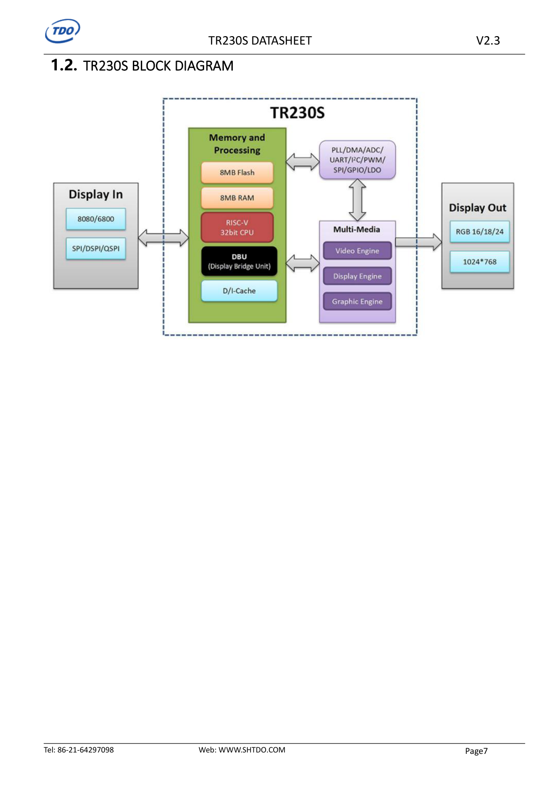
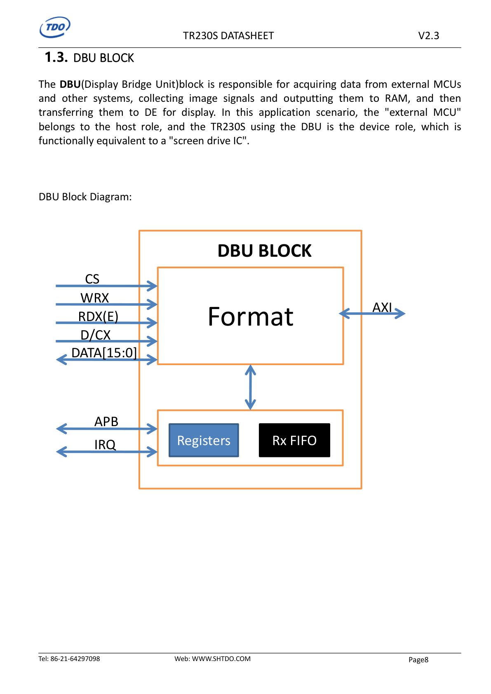
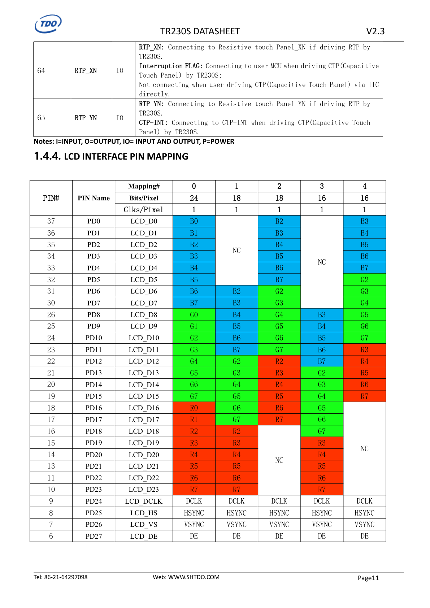
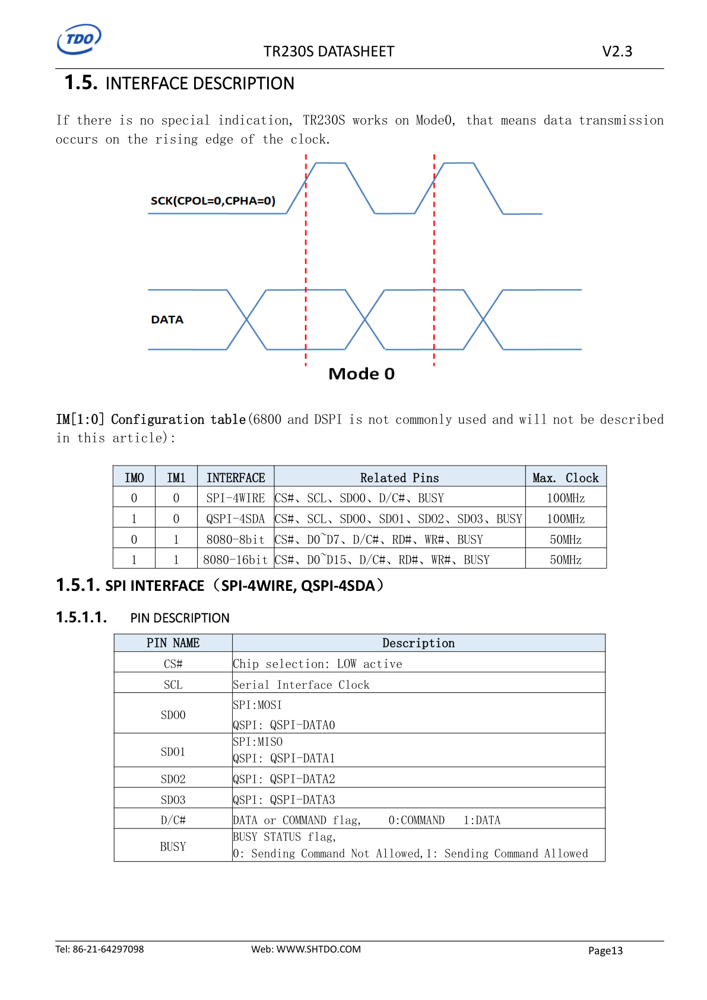
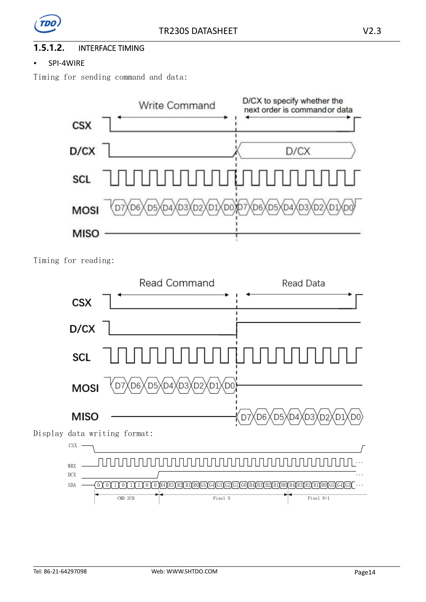
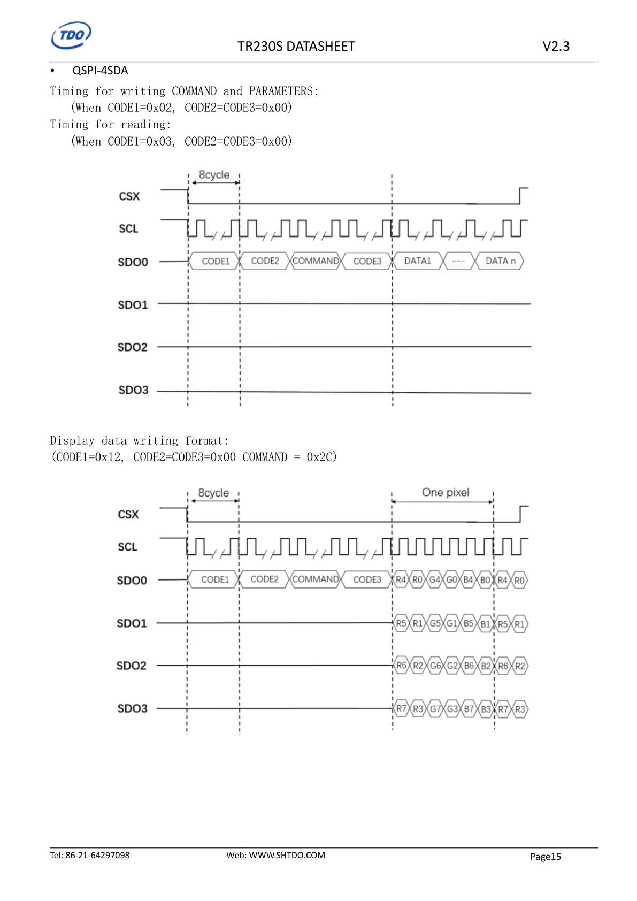
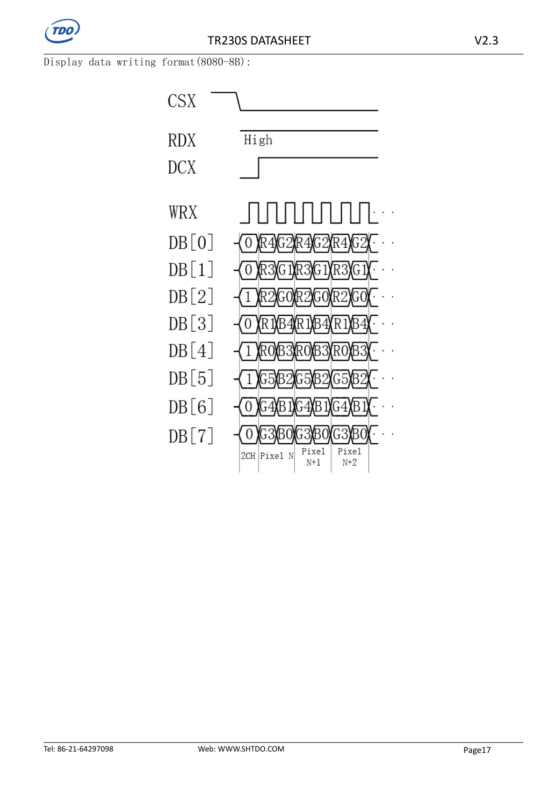
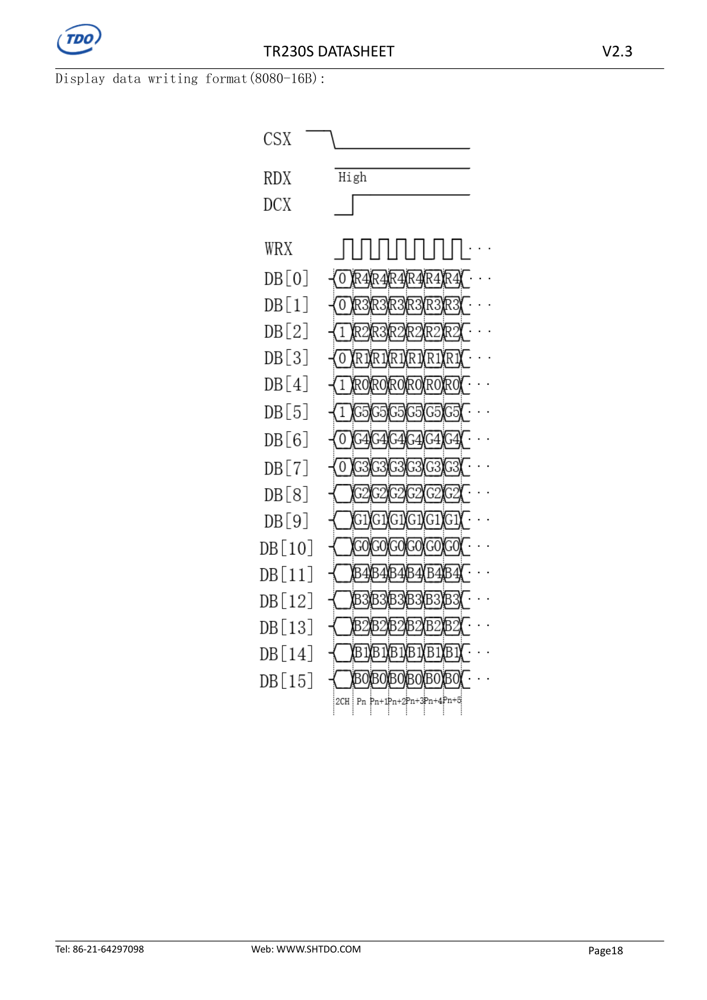
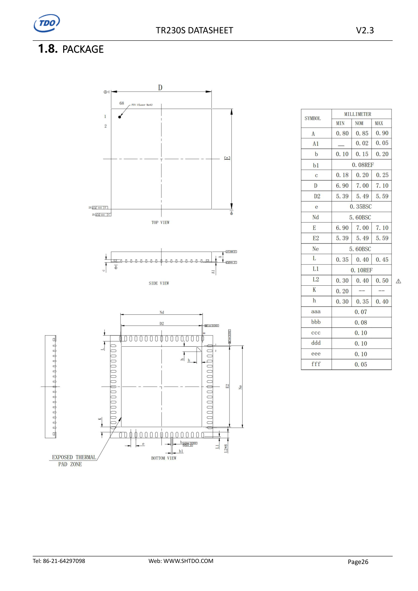

# TR230S Datasheet V2.3 整理

来源文件：`doc/TR230S DATASHEET_V2.3.pdf`  
PDF 版本：V2.3，日期 2024-11-20，Shanghai Top Display Optoelectronics / TDO  
整理时间：2026-05-20

本文把 TR230S 控制器 datasheet 整理成可搜索的 Markdown。原 PDF 中的时序图、框图、RGB 映射图和封装图已导出到 `doc/screen_assets/` 并在文中引用。

## 1. 快速结论

- TR230S 在本项目中等效为屏幕驱动 IC：ESP32-S3 作为 host，TR230S 的 DBU 作为 device 接收显示数据，再写入 RAM 并交给显示引擎输出到 LCD。
- 本项目屏幕模组 `TS040HDS02CP-B1620A` 使用 TR230S，外部主控侧主要关心 `SPI-4WIRE` / `QSPI-4SDA` 接口、`BUSY/WAIT#`、复位、背光和触摸相关引脚。
- TR230S 芯片自身工作电源为 `3.3 V`，I/O 绝对最大输入电压为 `-0.3 V ~ 3.6 V`，不得接入 5 V 逻辑。
- 串行接口默认工作在 Mode 0，数据在时钟上升沿传输。
- `SPI-4WIRE` 与 `QSPI-4SDA` 最大时钟 `100 MHz`；`8080 8/16-bit` 最大时钟 `50 MHz`。
- `BUSY` / 模组侧 `WAIT#`：`0 = 不允许发送命令`，`1 = 允许发送命令`。调试期建议接入主控并在写命令前检查。
- 显示写入核心命令：
  - `0x2A`：列地址窗口。
  - `0x2B`：行地址窗口。
  - `0x2C`：显示数据写入。
  - `0x3A`：输入像素格式，默认 `0x55`，即 RGB565。
  - `0x29`：Display On。
  - `0x28`：Display Off。
  - `0x5A`：Soft Reset，参数 `0x01`。
- QSPI 写命令格式：`CODE1=0x02, CODE2=0x00, COMMAND, CODE3=0x00, PARAM...`。
- QSPI 写显示数据格式：`CODE1=0x12, CODE2=0x00, COMMAND=0x2C, CODE3=0x00, PIXEL...`。
- QSPI 读格式：`CODE1=0x03, CODE2=CODE3=0x00`。

## 2. 修订记录

| Version | Date | Detail |
| --- | --- | --- |
| V1.0 | 2024-01-04 | First release |
| V2.0 | 2024-03-04 | Adding timing and register list |
| V2.1 | 2024-04-05 | Update register and RGB PIN mapping |
| V2.2 | 2024-05-05 | Update registers |
| V2.3 | 2024-11-20 | Update display data writing format |

## 3. 总体规格

### 3.1 CPU 与存储

| 模块 | 规格 |
| --- | --- |
| CPU | Single core E907，RV32IMAFC instruction architecture，`400 MHz @ 1.1 V` |
| Cache | D-Cache 32 KB，I-Cache 16 KB |
| 其他 CPU 能力 | PMP，CLINT，CLIC |
| SRAM | 32 KB |
| PSRAM | 8 MB |
| Flash | 8 MB |

### 3.2 图形和显示能力

| 模块 | 规格 |
| --- | --- |
| DE (Display Engine) | One UI layer with `1024 x 768 @ 60 fps` |
| DE 处理 | Dithering、Gamma correction、color matrix adjustments |
| GE (Graphic Engine) | 2D graphics acceleration，max `1080P @ 60 fps` |
| GE 能力 | 0/90/180/270 度硬件旋转、硬件镜像、硬件窗口、`1/16x ~ 16x` 缩放 |
| VE (Video Engine) | JPEG decoder max `720P @ 60 fps`，PNG decoder max `720P @ 60 fps` |
| Display Interface | Parallel RGB 16/18/24-bit，max resolution `1024 x 768 @ 60 fps` |

### 3.3 DBU 输入接口

DBU 是 Display Bridge Unit，负责从外部 MCU 或系统接收数据，把图像信号写入 RAM，再交给 DE 显示。

| 接口 | 能力 |
| --- | --- |
| 8080 parallel | 8-bit / 16-bit，最大 50 MHz |
| 6800 parallel | 8-bit / 16-bit，最大 50 MHz |
| SPI | 3-wire / 4-wire |
| DSPI | 支持 |
| QSPI | 4-SDA SPI，最大 100 MHz |

### 3.4 通用外设和电源

| 模块 | 规格 |
| --- | --- |
| SPI | 2 路，支持 3-wire / 4-wire |
| UART | 4 路，支持 2-wire / 3-wire / 4-wire，兼容 16550 |
| IIC | 2 路，最大 400 Kb/s |
| GPIO | 5 组，共 60 IO，每个 IO 可独立配置；输入支持二级去抖和中断 |
| 计数器 | GTC、WDOG、PWM |
| PWM | 最多 4 路 PWM，或 2 路互补 PWM，16-bit |
| GPADC | 6 通道 12-bit，1 MSPS |
| 触摸 | 集成 RTP 电阻触摸接口 |
| 时钟 | 内置 OSC24M，无晶振方案，精度 +/-2% |
| 电源 | 单 3.3 V 输入；内部 LDO25 / LDO18 / LDO1x |
| 温度 | 内置 THS 温度传感器，支持高低温中断和过温复位 |
| 封装 | QFN68，`7 x 7 x 0.85 mm`，pitch `0.35 mm` |
| 结温 | `-20 C ~ +105 C` |

## 4. 引脚定义

### 4.1 DBU 与 LCD 输出相关引脚

| Pin | Symbol | Type | 8080 功能 | SPI / DSPI / QSPI 功能 |
| --- | --- | --- | --- | --- |
| 48 | PB8 | IO | WR# write strobe input | SPI-CLK / DSPI-CLK / QSPI-CLK |
| 49 | PB9 | IO | RD# read strobe input | SPI-MOSI / DSPI-DATA0 / QSPI-DATA0 |
| 50 | CS# | I | Chip selection, low active | Chip selection, low active |
| 51 | D/C# | I | `1 = data/parameter`，`0 = command` | SPI-4WIRE 需要：`1 = data/parameter`，`0 = command` |
| 40 | PB0 | I | 8080-Data0 | - |
| 41 | PB1 | IO | 8080-Data1 | SPI-MISO / DSPI-DATA1 / QSPI-DATA1 |
| 42 | PB2 | IO | 8080-Data2 | QSPI-DATA2 |
| 43 | PB3 | IO | 8080-Data3 | QSPI-DATA3 |
| 44 | PB4 | I | 8080-Data4 | - |
| 45 | PB5 | I | 8080-Data5 | - |
| 46 | PB6 | I | 8080-Data6 | - |
| 47 | PB7 | I | 8080-Data7 | - |
| 66 | DBU_D8 | I | 8080-Data8 | - |
| 67 | DBU_D9 | I | 8080-Data9 | - |
| 68 | DBU_D10 | I | 8080-Data10 | - |
| 1 | DBU_D11 | I | 8080-Data11 | - |
| 2 | DBU_D12 | I | 8080-Data12 | - |
| 3 | DBU_D13 | I | 8080-Data13 | - |
| 4 | DBU_D14 | I | 8080-Data14 | - |
| 5 | DBU_D15 | I | 8080-Data15 | - |
| 6 | PD27 | O | LCD_DE | LCD_DE |
| 7 | PD26 | O | LCD_VS | LCD_VS |
| 8 | PD25 | O | LCD_HS | LCD_HS |
| 9 | PD24 | O | LCD_DCLK | LCD_DCLK |
| 10 | PD23 | O | LCD_D23 | LCD_D23 |
| 11 | PD22 | O | LCD_D22 | LCD_D22 |
| 13 | PD21 | O | LCD_D21 | LCD_D21 |
| 14 | PD20 | O | LCD_D20 | LCD_D20 |
| 15 | PD19 | O | LCD_D19 | LCD_D19 |
| 16 | PD18 | O | LCD_D18 | LCD_D18 |
| 17 | PD17 | O | LCD_D17 | LCD_D17 |
| 18 | PD16 | O | LCD_D16 | LCD_D16 |
| 19 | PD15 | O | LCD_D15 | LCD_D15 |
| 20 | PD14 | O | LCD_D14 | LCD_D14 |
| 21 | PD13 | O | LCD_D13 | LCD_D13 |
| 22 | PD12 | O | LCD_D12 | LCD_D12 |
| 23 | PD11 | O | LCD_D11 | LCD_D11 |
| 24 | PD10 | O | LCD_D10 | LCD_D10 |
| 25 | PD9 | O | LCD_D9 | LCD_D9 |
| 26 | PD8 | O | LCD_D8 | LCD_D8 |
| 30 | PD7 | O | LCD_D7 | LCD_D7 |
| 31 | PD6 | O | LCD_D6 | LCD_D6 |
| 32 | PD5 | O | LCD_D5 | LCD_D5 |
| 33 | PD4 | O | LCD_D4 | LCD_D4 |
| 34 | PD3 | O | LCD_D3 | LCD_D3 |
| 35 | PD2 | O | LCD_D2 | LCD_D2 |
| 36 | PD1 | O | LCD_D1 | LCD_D1 |
| 37 | PD0 | O | LCD_D0 | LCD_D0 |

### 4.2 电源引脚

| Pin | Symbol | Type | Description |
| --- | --- | --- | --- |
| 12, 29, 54 | VCC33_IO | P | External 3.3 V power supply input for IO |
| 27, 53 | VDD11_SYS | O | Internal 1.x V LDO output，接 1 uF 去耦到 GND |
| 28 | LDO18 | O | Internal 1.8 V LDO output，接 1 uF 和 10 uF 去耦到 GND |
| 55 | LDO25 | O | Internal 2.5 V LDO output，接 1 uF 去耦到 GND |
| 69 | GND | P | GND，同时也是 thermal pad |

### 4.3 其他 GPIO

| Pin | Symbol | Type | Description |
| --- | --- | --- | --- |
| 38 | BL-PWM | O | PWM output for controlling backlight driver |
| 39 | CTP-RST | IO | CTP reset，低有效；由 TR230S 驱动 CTP 时接 CTP-RST |
| 52 | RESET# | I | RESET for TR230S and LCD，低有效 |
| 56 | DBG_TXD | IO | 3.3 V TTL UART TX，用于 TR230S firmware update 预留测试点，需要 10 kohm 上拉 |
| 57 | DBG_RXD | IO | 3.3 V TTL UART RX，用于 TR230S firmware update 预留测试点，需要 10 kohm 上拉 |
| 58 | GPADC2 | IO | RGB+SPI 面板初始化时可作 LCDInit-SPICLK；由 TR230S 驱动 CTP 时可作 CTP-SCL，需要 2.2 kohm ~ 4.7 kohm 上拉 |
| 59 | GPADC3 | IO | RGB+SPI 面板初始化时可作 LCDInit-SPIDATA；由 TR230S 驱动 CTP 时可作 CTP-SDA，需要 2.2 kohm ~ 4.7 kohm 上拉 |
| 60 | GPADC4 | IO | RGB+SPI 面板初始化时可作 LCDInit-CS |
| 61 | BUSY | O | `0 = Sending Command Not Allowed`，`1 = Sending Command Allowed` |
| 62 | RTP_YP | IO | RTP_YP；也作为 IM0 interface configuration pin |
| 63 | RTP_XP | IO | RTP_XP；也作为 IM1 interface configuration pin |
| 64 | RTP_XN | IO | RTP_XN；由 TR230S 驱动 CTP 时也可作 interruption flag；若用户通过 IIC 直接驱动 CTP，则不连接 |
| 65 | RTP_YN | IO | RTP_YN；由 TR230S 驱动 CTP 时接 CTP-INT |

I/O 标注：`I = Input`，`O = Output`，`IO = Input and Output`，`P = Power`。

## 5. LCD RGB 输出映射

TR230S 提供 5 种 LCD RGB 输出 mapping。默认是 `24 bits/pixel`；也可配置为 18-bit 或 16-bit，低位不用。

| Mapping | Bits/Pixel | Clks/Pixel | 说明 |
| --- | --- | --- | --- |
| 0 | 24 | 1 | 支持 R/G/B 信号互换，也支持组内高低位顺序互换；文档推荐 |
| 1 | 18 | 1 | 支持整组 R/G/B 信号互换；文档推荐 |
| 2 | 18 | 1 | 支持 R/G/B 信号互换 |
| 3 | 16 | 1 | 支持 R/G/B 信号互换；文档推荐 |
| 4 | 16 | 1 | 支持 R/G/B 信号互换 |

RGB 映射表较大，已保留原图，排查颜色顺序、RGB565 高低位和并口 RGB 面板连接时建议直接查看。

## 6. Host 接口

除非特别说明，TR230S 工作在 Mode 0，数据在时钟上升沿传输。

### 6.1 IM[1:0] 配置

| IM0 | IM1 | Interface | Related Pins | Max Clock |
| --- | --- | --- | --- | --- |
| 0 | 0 | SPI-4WIRE | CS#、SCL、SDO0、D/C#、BUSY | 100 MHz |
| 1 | 0 | QSPI-4SDA | CS#、SCL、SDO0、SDO1、SDO2、SDO3、BUSY | 100 MHz |
| 0 | 1 | 8080-8bit | CS#、D0~D7、D/C#、RD#、WR#、BUSY | 50 MHz |
| 1 | 1 | 8080-16bit | CS#、D0~D15、D/C#、RD#、WR#、BUSY | 50 MHz |

文档说明 6800 和 DSPI 不常用，因此未展开。

### 6.2 SPI / QSPI 引脚

| Pin Name | Description |
| --- | --- |
| CS# | Chip selection: low active |
| SCL | Serial Interface Clock |
| SDO0 | SPI: MOSI；QSPI: QSPI-DATA0 |
| SDO1 | SPI: MISO；QSPI: QSPI-DATA1 |
| SDO2 | QSPI: QSPI-DATA2 |
| SDO3 | QSPI: QSPI-DATA3 |
| D/C# | `0 = command`，`1 = data`，SPI-4WIRE 使用 |
| BUSY | `0 = not allowed`，`1 = allowed` |

### 6.3 SPI-4WIRE 时序

SPI-4WIRE 发送命令和数据：

- `CS#` 低有效。
- `D/C# = 0` 时发送命令。
- `D/C# = 1` 时发送参数或数据。
- `MOSI` 按 `D7 -> D0` 发送。
- 读操作中，主机先在 `MOSI` 发读命令，再在 `MISO` 收 `D7 -> D0`。

显示数据写入格式：

- 先发命令 `0x2C`。
- 然后发连续像素数据。
- 图示以 RGB565 表达像素位流：`R4 R3 R2 R1 R0 G5 G4 G3 G2 G1 G0 B4 B3 B2 B1 B0`。

### 6.4 QSPI-4SDA 时序

写命令和参数：

- `CODE1 = 0x02`
- `CODE2 = 0x00`
- `CODE3 = 0x00`
- 时序结构：`CODE1 -> CODE2 -> COMMAND -> CODE3 -> DATA1 ... DATAn`

读操作：

- `CODE1 = 0x03`
- `CODE2 = 0x00`
- `CODE3 = 0x00`

显示数据写入：

- `CODE1 = 0x12`
- `CODE2 = 0x00`
- `COMMAND = 0x2C`
- `CODE3 = 0x00`
- 后续像素数据通过 `SDO0..SDO3` 四条数据线并行传输。

QSPI 像素位序图中，单像素分布为：

| Line | Bits shown for one RGB565 pixel |
| --- | --- |
| SDO0 | R4, R0, G4, G0, B4, B0 |
| SDO1 | R5, R1, G5, G1, B5, B1 |
| SDO2 | R6, R2, G6, G2, B6, B2 |
| SDO3 | R7, R3, G7, G3, B7, B3 |

说明：图中位名使用 R7..R0 / G7..G0 / B7..B0 方式标注，即按 8-bit 分量位置描述。若输入格式设为 RGB565，需要结合 `0x3A` 和供应商初始化代码确认实际打包。

### 6.5 8080 接口

8080 接口引脚：

| Pin Name | Description |
| --- | --- |
| CS# | Chip selection: low active |
| WR | Write strobe input，rising edge effective |
| RD | Read strobe input，rising edge effective |
| DB0~DB15 | Data bus |
| D/C# | `0 = command`，`1 = data` |
| BUSY | `0 = not allowed`，`1 = allowed` |

8080-8B 显示数据写入格式图：

8080-16B 显示数据写入格式图：

## 7. 寄存器整理

### 7.1 基础显示寄存器

| Command | Name | R/W | Parameters | Default | Description |
| --- | --- | --- | --- | --- | --- |
| `0x01` | Version | R | 1 byte：高/低版本号 | - | 返回版本 `H.L` |
| `0x12` | Self Test | W | 1 byte `format` | `0x00` | `0x00 = off`，`0x01 = on` |
| `0x20` | PWM Duty Ratio Setting | W | 1 byte `Duty` | `0x00` | 背光 PWM 占空比，`0~100`，`0x64 = 100%` |
| `0x21` | PWM Frequency Setting | W | 1 byte `CLK` | `0x0A` | 背光 PWM 频率，`0~100 KHz`，`0x64 = 100 KHz` |
| `0x28` | Display Off | W | 无参数 | - | 关闭显示 |
| `0x29` | Display On | W | 无参数 | - | 开启显示 |
| `0x2A` | COL_ADR | W | `X_S(H), X_S(L), X_E(H), X_E(L)` | `0x00...` | 列地址窗口 |
| `0x2B` | ROW_ADR | W | `Y_S(H), Y_S(L), Y_E(H), Y_E(L)` | `0x00...` | 行地址窗口 |
| `0x2C` | DISPLAY DATA | W | Display data | - | 显示数据写入命令，属于特殊命令，使用方式参考接口时序 |
| `0x3A` | DISPLAY FORMAT | W | 1 byte `format` | `0x55` | `0x55 = RGB565`，`0x66 = RGB666`，`0x77 = RGB888` |
| `0x5A` | Soft Reset | W | 1 byte `0x01` | - | 软件复位 |

### 7.2 RGB 输出与屏参寄存器

#### `0x70` RGB Interface Setting

参数：

| Param | Name | Default | Description |
| --- | --- | --- | --- |
| 1 | Mode | `0x01` | `0x01 = Parallel RGB` |
| 2 | Format | `0x01` | `0x01 = RGB24 Mapping0`；`0x02 = RGB18 low bits drop Mapping1`；`0x03 = RGB18 high bits drop Mapping2`；`0x04 = RGB16 low bits drop Mapping3`；`0x05 = RGB16 high bits drop Mapping4` |
| 3 | Clock_Phase | `0x01` | `0x01 = 0 deg`；`0x02 = 90 deg`；`0x03 = 180 deg`；`0x04 = 270 deg` |
| 4 | Data_Order | `0x00` | `0x01 = RGB`；`0x02 = RBG`；`0x03 = BGR`；`0x04 = BRG`；`0x05 = GRB`；`0x06 = GBR` |
| 5 | Data_mirror | `0x00` | `0x00 = LSB to MSB`；`0x01 = MSB to LSB` |

#### `0x71` Resolution and Clock Setting

| Param | Name | Default | Description |
| --- | --- | --- | --- |
| 1 | CLK | `0x00` | Pixel clock setting，范围 `0~48 MHz`，`0x30 = 48 MHz` |
| 2 | Hactive(H) | `0x00` | 水平有效像素高字节 |
| 3 | Hactive(L) | `0x00` | 水平有效像素低字节 |
| 4 | Vactive(H) | `0x00` | 垂直有效像素高字节 |
| 5 | Vactive(L) | `0x00` | 垂直有效像素低字节 |

#### `0x72` Horizontal Porch Setting

参数：

- `H-front porch (H)`
- `H-front porch (L)`
- `H-back porch (H)`
- `H-back porch (L)`
- `H-sync pulse width (H)`
- `H-sync pulse width (L)`

#### `0x73` Vertical Porch Setting

参数：

- `V-front porch (H)`
- `V-front porch (L)`
- `V-back porch (H)`
- `V-back porch (L)`
- `V-sync pulse width (H)`
- `V-sync pulse width (L)`

### 7.3 字体和 Host SPI 寄存器

| Command | Name | R/W | Parameters | Default | Description |
| --- | --- | --- | --- | --- | --- |
| `0x75` | FONT Property Setting | W | 9 bytes | 多项默认见下 | 设置字体间距、行距、前景/背景色 |
| `0x76` | Host SPI function Enable | W | 1 byte `format` | `0x00` | 使用 SPI 接口发送 panel 初始化代码；`0x01 = enable`，`0x00 = disable` |
| `0x80` | Host SPI Sending format | W | `CMD, PARAMETERs...` | - | 发送初始化代码时的格式，第 1 参数是 command register，后续是参数 |
| `0x81` | 16x16 Standard FONT library | W | `X(H), X(L), Y(H), Y(L), String...` | - | GBK 16x16 点阵；ASCII 半宽 8x16 |
| `0x82` | 24x24 Standard FONT library | W | `X(H), X(L), Y(H), Y(L), String...` | - | GBK 24x24 点阵；ASCII 半宽 12x24 |

`0x75` 字体属性参数：

| Param | Name | Default | Description |
| --- | --- | --- | --- |
| 1 | Kerning(H) | `0x00` | 字间距高字节 |
| 2 | Kerning(L) | `0x00` | 字间距低字节 |
| 3 | Space(H) | `0x00` | 行间距高字节 |
| 4 | Space(L) | `0x00` | 行间距低字节 |
| 5 | F_E / B_E | `0x00` | `F_E: 0 = enable foreground, 1 = disable`；`B_E: 0 = enable background, 1 = disable` |
| 6 | F_COLOR(H) | `0x00` | 前景色高字节 |
| 7 | F_COLOR(L) | `0x00` | 前景色低字节 |
| 8 | B_COLOR(H) | `0xFF` | 背景色高字节 |
| 9 | B_COLOR(L) | `0xFF` | 背景色低字节 |

### 7.4 触摸寄存器

这些寄存器用于 TR230S 驱动触摸屏的路径。项目若让 ESP32-S3 直接通过 I2C 读取 FT6336U，通常不走这些寄存器。

| Command | Name | R/W | Parameters | Default | Description |
| --- | --- | --- | --- | --- | --- |
| `0xA0` | TP FUNCTION ENABLE | W | 1 byte `format` | `0x00` | `0x00 = disable touch function`，`0x01 = enable touch function` |
| `0xA1` | TP STATUS | R | 1 byte `TP_STATUS` | `0x00` | `0x00 = no touching events`，`0x01 = pressing`，`0x02 = releasing` |
| `0xA2` | TP Coordinate | R | `X(H), X(L), Y(H), Y(L)` | `0x00...` | 触摸坐标 `(X,Y)` |
| `0xA3` | Clearing TP STATUS | W | 1 byte `format` | - | `0x00 = clear TP status` |

### 7.5 绘图寄存器

| Command | Name | Parameters | Description |
| --- | --- | --- | --- |
| `0xB0` | Drawing LINE | `X_S(H), X_S(L), Y_S(H), Y_S(L), X_E(H), X_E(L), Y_E(H), Y_E(L), Width, COLOR(H), COLOR(L)` | 从 `(X_S,Y_S)` 到 `(X_E,Y_E)` 画线；颜色为 16-bit |
| `0xB1` | Drawing CIRCLE | `X(H), X(L), Y(H), Y(L), R(H), R(L), COLOR(H), COLOR(L)` | 以 `(X,Y)` 为圆心，半径 `R` 画圆 |
| `0xB2` | Drawing RECTANGLE | `X1(H), X1(L), Y1(H), Y1(L), X2(H), X2(L), Y2(H), Y2(L), COLOR(H), COLOR(L)` | 左上角 `(X1,Y1)`，右下角 `(X2,Y2)` 画矩形 |

### 7.6 镜像、旋转和缩放

`0xAC` MIRROR AND ROTATION：

| Value | Description |
| --- | --- |
| `0x00` | No Rotation |
| `0x01` | Rotation 90 degrees |
| `0x02` | Rotation 180 degrees |
| `0x03` | Rotation 270 degrees |
| `0x10` | X-axis mirror image |
| `0x20` | Y-axis mirror image |
| `0x40` | Scaling |

## 8. 电气特性

### 8.1 绝对最大额定值

| Symbol | Description | Min | Max | Unit |
| --- | --- | --- | --- | --- |
| Tstg | Storage Temperature | -40 | 125 | C |
| II/O | In/Out current for input and output | -50 | 60 | mA |
| VI/O | I/O input voltage | -0.3 | 3.6 | V |
| VCC | Power Supply for VCC | -0.3 | 3.6 | V |

### 8.2 推荐工作条件

| Symbol | Description | Min | Typ | Max | Unit |
| --- | --- | --- | --- | --- | --- |
| Ta | Ambient Operating Temperature | -20 | - | 85 | C |
| Tj | Junction Temperature | -20 | - | 105 | C |
| VCC | Power Supply | 3.3 | 3.3 | 3.6 | V |

### 8.3 I/O 特性

| Symbol | Description | Min | Typ | Max | Unit |
| --- | --- | --- | --- | --- | --- |
| VIH | High-Level Input Voltage | `0.7 * 3.3` | - | `3.3 + 0.3` | V |
| VIL | Low-Level Input Voltage | -0.3 | - | `0.3 * 3.3` | V |
| RPU | Input pull-up resistance | - | 33 | - | kohm |
| RPD | Input pull-down resistance | - | 33 | - | kohm |
| IIH | High-Level Input Current | - | - | 10 | uA |
| IIL | Low-Level Input Current | - | - | 10 | uA |
| VOH | High-Level Output Voltage | `3.3 - 0.2` | - | 3.3 | V |
| VOL | Low-Level Output Voltage | 0 | - | 0.2 | V |
| IOZ | Tri-State Output Leakage Current | -10 | - | 10 | uA |
| CIN | Input Capacitance | - | - | 5 | pF |
| COUT | Output Capacitance | - | - | 5 | pF |

## 9. 封装

TR230S 封装为 QFN68，`7 x 7 x 0.85 mm`，pitch `0.35 mm`。封装原图如下。

## 10. 对本项目驱动实现的建议

### 10.1 推荐 QSPI 初始化路径

首版建议主控侧按 QSPI-4SDA 接入：

1. 上电确认屏幕 5 V 电源、TR230S 3.3 V 逻辑、电源地共地。
2. 拉低 `RESET#` 后释放，等待 TR230S 和 LCD 复位完成。
3. 读 `BUSY/WAIT#`，确认 `1` 后再发送命令。
4. 使用 QSPI 命令格式发送基础配置：
   - `0x5A 0x01` 软复位。
   - `0x3A 0x55` 设置 RGB565，或按供应商初始化代码使用 RGB666/RGB888。
   - `0x2A` / `0x2B` 设置窗口为 `0..719`。
   - `0x29` 开显示。
5. 写帧时使用 QSPI display data 格式，以 `0x2C` 开始推送像素。

### 10.2 地址窗口参数示例

720 x 720 全屏窗口：

| Command | Parameters |
| --- | --- |
| `0x2A` | `0x00, 0x00, 0x02, 0xCF` |
| `0x2B` | `0x00, 0x00, 0x02, 0xCF` |

说明：`719 = 0x02CF`。如果出现横竖颠倒、镜像或偏移，应先核对 `0xAC`、`0x70`、坐标方向和供应商初始化代码。

### 10.3 关键风险

- TR230S I/O 绝对最大仅到 3.6 V，不允许 5 V IO 直连。
- `BUSY/WAIT# = 0` 时不要继续发命令，否则可能丢命令或异常显示。
- QSPI 模式下 `D/C#` 不参与命令/数据区分，不要把 SPI-4WIRE 的 `D/C#` 写法直接套到 QSPI。
- `0x2C` 是特殊显示数据命令，QSPI 下需要使用 `CODE1=0x12` 的显示写入格式。
- 720 x 720 全屏 RGB565 一帧约 `720 * 720 * 2 = 1,036,800 bytes`，ESP32-S3 侧不应频繁全帧刷新；建议 LVGL 局部刷新 + 行缓冲。
