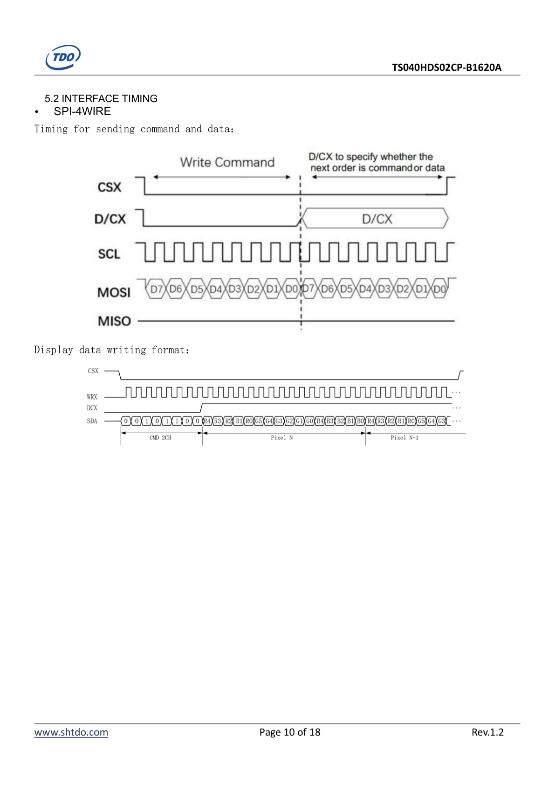
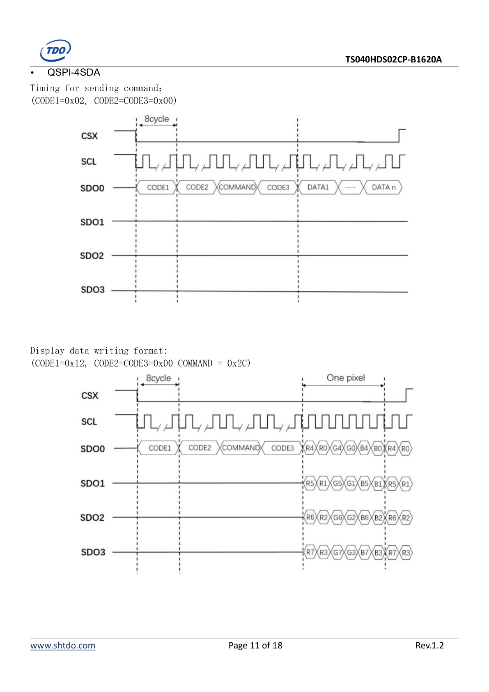
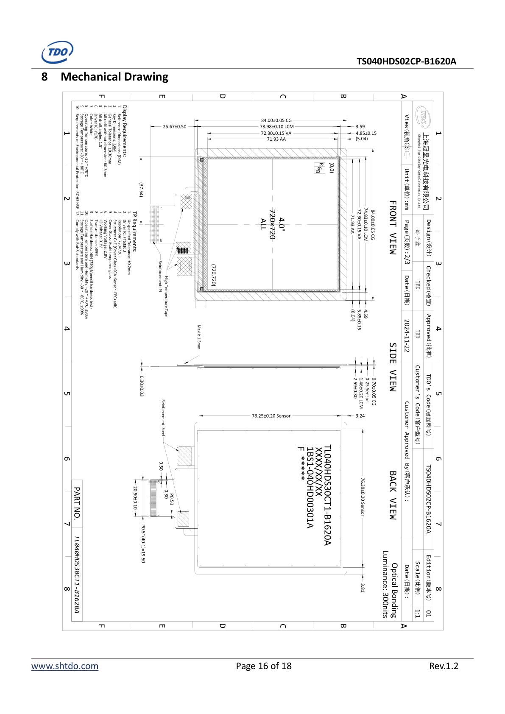
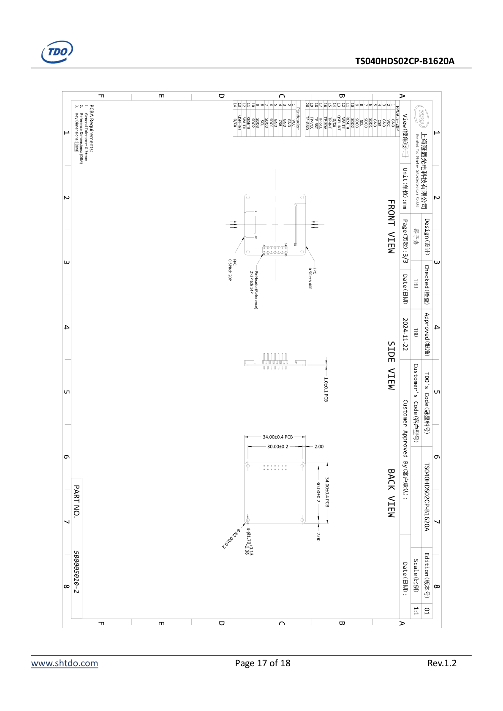

# TS040HDS02CP-B1620A 屏幕模组规格整理

来源文件：`doc/屏幕技术文档Specification_TS040HDS02CP-B1620A_V1.2(1).pdf`  
PDF 版本：Rev.1.2，日期 2025-11-15，上海冠显光电科技有限公司 / Shanghai Top Display Optoelectronics  
整理时间：2026-05-19

本文把屏幕模组 PDF 转成便于检索的 Markdown。涉及接线和上电前，仍需以实物丝印、排线方向和供应商原图为准复核。

## 1. 快速结论

- 模组型号：`TS040HDS02CP-B1620A`。
- 屏幕尺寸：4.0 inch。
- 分辨率：`720 RGB x 720`。
- 显示驱动：`TR230S`。
- 触摸驱动：`FT6336U`，触摸接口为 I2C。
- 显示接口：`QSPI-4SDA` 或 `SPI-4WIRE`。
- 模组主电源：`VCC = 5 V`，推荐范围 `4.5 V ~ 5.5 V`。
- 逻辑输入电平：按 `3.3 V` 逻辑，`VIH >= 0.7 * 3.3 V`，`VIL <= 0.3 * 3.3 V`。
- 典型模组电流：`IVCC = 186 mA`，条件为 `VCC = 5 V`、color bar pattern。
- 背光：8 颗 LED，`4 串 2 并`；文档标注模组已集成背光驱动电路。
- 背光典型条件：`IF = 40 mA`，`VF = 12.8 V`，典型背光功耗 `512 mW`。
- 最大串行显示接口时钟：`SPI-4WIRE` 与 `QSPI-4SDA` 都为 `100 MHz`。
- `WAIT#` 表示 TR230S 是否允许发送命令：`0 = 不允许发送命令`，`1 = 允许发送命令`。
- QSPI 模式下 `D/C#` 标为 `NOT CONNECTION`；SPI-4WIRE 模式下 `D/C#` 用于区分命令和数据。

项目接入注意：

- 屏幕模组 `VCC` 是 5 V，但 ESP32-S3 GPIO 只能接 3.3 V 逻辑，不能把任何 5 V 信号接入 GPIO。
- I2C 触摸 `TP-SDA` / `TP-SCL` 建议上拉到 3.3 V，不得上拉到 5 V。
- 首版建议优先走 `QSPI-4SDA`，`SPI-4WIRE` 用作调试保底。
- 如果主控直接通过 I2C 读取 FT6336U，`QSPI-INT` / HOST 触摸中断脚按文档说明可以不接；主控应使用 `TP-INT`、`TP-SDA`、`TP-SCL`、`TP-RST`。

## 2. 修订记录

| Rev. | 日期 | 说明 | 编辑 |
| --- | --- | --- | --- |
| 1.0 | 2025-01-11 | First release | Hongwei.Li |
| 1.1 | 2025-07-25 | Change brightness information | Hongwei.Li |
| 1.2 | 2025-11-15 | Change interface information | Hongwei.Li |

## 3. 通用规格

| No. | 项目 | 规格 | 备注 |
| --- | --- | --- | --- |
| 1 | LCD Size | 4.0 inch |  |
| 2 | Driver Element | a-Si TFT active matrix |  |
| 3 | Resolution | 720 (RGB) x 720 |  |
| 4 | Display Mode | Normally Black |  |
| 5 | Pixel Pitch | 0.0999 (H) x 0.0999 (V) mm |  |
| 6 | Display Colors | 262K |  |
| 7 | Surface Treatment | -- |  |
| 8 | Color Arrangement | RGB-Stripe |  |
| 9 | Interface | QSPI / SPI |  |
| 10 | Viewing Direction | ALL |  |
| 11 | Gray Scale Inversion Direction | -- | Note 1 |
| 12 | Outline Dimension | 84.00 (W) x 84.00 (H) mm |  |
| 13 | Active Area | 71.93 (W) x 71.93 (H) mm |  |
| 14 | Touch Screen | CTP |  |
| 15 | Display Driver IC | TR230S |  |
| 16 | Touch Driver IC | FT6336U |  |

补充说明：

- 最佳图像质量的观看方向与 TFT 定义存在 180 度偏移。
- 文档标注 RoHS compliant。

## 4. 引脚定义

### 4.1 连接器 1：20-pin FPC

匹配连接器：`XF2M-2015-1A`（OMRON）或等效件。

| Pin | Symbol | I/O | Description | Remark |
| --- | --- | --- | --- | --- |
| 1 | GND | P | Ground |  |
| 2 | VCC | P | POWER INPUT | 5 V 主电源 |
| 3 | GND | P | Ground |  |
| 4 | CS# | I | Chip selection: LOW active | 低有效 |
| 5 | GND | P | Ground |  |
| 6 | SDO1 | I | SPI: SPI-MISO；QSPI: QSPI-DATA1 | SPI 读数据 / QSPI 数据线 1 |
| 7 | SDO0 | I | SPI: SPI-MOSI；QSPI: SPI-DATA0 | SPI 写数据 / QSPI 数据线 0 |
| 8 | SCL | I | SPI/QSPI: SPI-Clock | 串行时钟 |
| 9 | SDO3 | I | QSPI: QSPI-DATA3 | QSPI 数据线 3 |
| 10 | SDO2 | I | QSPI: QSPI-DATA2 | QSPI 数据线 2 |
| 11 | RESET# | I | TR230S Module_RESET and LCD-RESET: LOW active | 低有效复位 |
| 12 | WAIT# | I | WAIT# status flag: `0` not allowed, `1` allowed | 建议接入主控用于忙等待 |
| 13 | QSPI-INT | O | Touch interrupt | Note 2 |
| 14 | D/C# | I | SPI-4WIRE 下 `H = DATA/parameter`，`L = COMMAND`；QSPI 下不连接 | QSPI 模式不接 |
| 15 | TP-INT | O | Touch Interrupt | FT6336U 中断 |
| 16 | TP-SDA | I/O | Touch IIC Data signal | I2C 数据 |
| 17 | TP-SCL | I | Touch IIC Clock signal | I2C 时钟 |
| 18 | TP-RST | I | Touch Reset Signal | 触摸复位 |
| 19 | TP-VCC | P | NC (Shared screen power supply) | 文档标注 NC，共用屏幕电源 |
| 20 | TP-GND | P | Touch Ground |  |

### 4.2 连接器 2：2.00 mm 2x7 Pin Header

| Pin | Symbol | I/O | Description | Remark |
| --- | --- | --- | --- | --- |
| 1 | VCC | P | POWER INPUT | 5 V 主电源 |
| 2 | GND | P | Ground |  |
| 3 | GND | P | Ground |  |
| 4 | CS# | I | Chip selection: LOW active | 低有效 |
| 5 | GND | P | Ground |  |
| 6 | SDO1 | O | SPI: SPI-MISO；QSPI: QSPI-DATA1 | SPI 读数据 / QSPI 数据线 1 |
| 7 | SDO0 | I | SPI: SPI-MOSI；QSPI: SPI-DATA0 | SPI 写数据 / QSPI 数据线 0 |
| 8 | SCL | I | SPI/QSPI: SPI-Clock | 串行时钟 |
| 9 | SDO3 | I | QSPI: QSPI-DATA3 | QSPI 数据线 3 |
| 10 | SDO2 | I | QSPI: QSPI-DATA2 | QSPI 数据线 2 |
| 11 | RESET# | I | TR230S Module_RESET and LCD-RESET: LOW active | 低有效复位 |
| 12 | WAIT# | I/O | WAIT# status flag: `0` not allowed, `1` allowed | 忙状态 |
| 13 | QSPI-INT | I/O | Touch interrupt | Note 2 |
| 14 | D/C# | I/O | SPI-4WIRE 下 `H = DATA/parameter`，`L = COMMAND`；QSPI 下不连接 | QSPI 模式不接 |

I/O 标注：`I = Input`，`O = Output`，`P = Power/Ground`。不同连接器对少量信号方向标注不同，实际接入时应以主控与模组方向、示波器验证和供应商确认结果为准。

### 4.3 IM[1:0] 接口配置

| IM0 | IM1 | Interface | Related Pins | Max Clock |
| --- | --- | --- | --- | --- |
| 0 | 0 | SPI-4WIRE | CS#、SCL、SDO0、D/C#、WAIT# | 100 MHz |
| 1 | 0 | QSPI-4SDA | CS#、SCL、SDO0、SDO1、SDO2、SDO3、WAIT# | 100 MHz |

触摸中断说明：

- 如果用户主控直接通过 I2C 驱动触摸屏，HOST / `QSPI-INT` 引脚不需要连接。
- 如果由 TR230S 驱动触摸屏，用户主控需要检测该引脚以决定是否读取触摸事件。

## 5. 绝对最大额定值

条件：`Ta = 25 C`。

| Item | Symbol | Min. | Max. | Unit | Remark |
| --- | --- | --- | --- | --- | --- |
| Power Voltage | VCC | -0.30 | +5.8 | V | 模组主电源 |
| Touch Power | TP_VCC | -0.50 | +3.6 | V | 触摸电源 |
| Operating Temperature | Top | -20.0 | 70.0 | C | 工作温度 |
| Storage Temperature | Tst | -30.0 | 80.0 | C | 存储温度 |
| Operating and Storage Humidity | Hstg | 10% | 90% | %RH | 湿度 |

## 6. 电气特性

### 6.1 推荐工作条件

条件：`VCC = 5 V`，`GND = 0 V`，`Ta = 25 C`。

| Item | Symbol | Min. | Typ. | Max. | Unit | Remark |
| --- | --- | --- | --- | --- | --- | --- |
| Power supply Voltage | VCC | 4.5 | 5 | 5.5 | V | 模组主电源 |
| TP Power | TP_VCC | 2.8 | 3.0 | 3.3 | V | 触摸电源 |
| Input Signal Voltage Low Level | VIL | -0.3 | - | 0.3 * 3.3 | V | 3.3 V 逻辑 |
| Input Signal Voltage High Level | VIH | 0.7 * 3.3 | - | 3.3 + 0.3 | V | 3.3 V 逻辑 |
| Power supply current | IVCC | - | 186 | - | mA | `VCC = 5 V`，color bar pattern |

### 6.2 背光单元驱动条件

| Item | Symbol | Min. | Typ. | Max. | Unit | Remark |
| --- | --- | --- | --- | --- | --- | --- |
| Forward Current | IF | - | 40 | 50 | mA | 8 LEDs，4 串 2 并 |
| Forward Current Voltage | VF | - | 12.8 | 14 | V | 参考值 |
| Backlight Power Consumption | WBL | - | 512 | 700 | mW |  |
| Operating Life Time | -- | 30000 | -- | -- | hrs | 亮度降至初始值 50% 的估计时间 |

背光说明：

- LED 条件按每个模组定义：`4 LED Serial, 2 LED Parallel`。
- LCM 工作时应输入稳定正向电流，正向电压仅供参考。
- 高电流、高环境温度和高湿度会缩短 LED 寿命。
- 文档 Note 5 明确：产品已经集成背光驱动电路。

## 7. 接口描述

除非特别说明，TR230S 工作在 SPI Mode 0，即数据在时钟上升沿传输。

### 7.1 串行接口引脚

| Pin Name | Description |
| --- | --- |
| CS# | Chip selection: LOW active |
| SCL | Serial Interface Clock |
| SDO0 | SPI: MOSI；QSPI: QSPI-DATA0 |
| SDO1 | SPI: MISO；QSPI: QSPI-DATA1 |
| SDO2 | QSPI: QSPI-DATA2 |
| SDO3 | QSPI: QSPI-DATA3 |
| D/C# | DATA or COMMAND flag：`0 = COMMAND`，`1 = DATA` |
| WAIT# | WAIT# status flag：`0 = Sending Command Not Allowed`，`1 = Sending Command Allowed` |

### 7.2 SPI-4WIRE 时序

SPI-4WIRE 使用 `CS#`、`SCL`、`SDO0/MOSI`、`SDO1/MISO`、`D/C#`、`WAIT#`。

- 写命令时 `D/C# = 0`，写数据/参数时 `D/C# = 1`。
- 数据在 SCL 上升沿传输。
- 图示显示命令和数据均按 `D7 -> D0` 顺序串行发送。
- 显示数据写入格式中，先发送 `0x2C`，之后连续发送像素数据。
- 图示像素数据按 RGB565 位序标注：`R4 R3 R2 R1 R0 G5 G4 G3 G2 G1 G0 B4 B3 B2 B1 B0`。

### 7.3 QSPI-4SDA 时序

QSPI-4SDA 使用 `CS#`、`SCL`、`SDO0`、`SDO1`、`SDO2`、`SDO3`、`WAIT#`。模组文档标注 QSPI 下 `D/C#` 不连接。

命令写入格式：

- `CODE1 = 0x02`
- `CODE2 = 0x00`
- `CODE3 = 0x00`
- 命令和参数阶段图示为 `CODE1 -> CODE2 -> COMMAND -> CODE3 -> DATA1 ... DATAn`

显示数据写入格式：

- `CODE1 = 0x12`
- `CODE2 = 0x00`
- `CODE3 = 0x00`
- `COMMAND = 0x2C`
- 后续像素数据在 `SDO0..SDO3` 四条线上并行传输。

图示以 RGB 分量位标注 QSPI 像素流。实际项目中若使用 `RGB565`、`RGB666` 或 `RGB888`，需要同时核对 TR230S `0x3A DISPLAY FORMAT` 设置和供应商初始化代码。

## 8. 光学特性

条件：`Ta = 25 C`。

| Item | Symbol | Condition | Min. | Typ. | Max. | Unit | Remark |
| --- | --- | --- | --- | --- | --- | --- | --- |
| View Angle Top | thetaT | CR >= 10 | 80 | 85 | - | Degree | Note 2 |
| View Angle Bottom | thetaB | CR >= 10 | 80 | 85 | - | Degree | Note 2 |
| View Angle Left | thetaL | CR >= 10 | 80 | 85 | - | Degree | Note 2 |
| View Angle Right | thetaR | CR >= 10 | 80 | 85 | - | Degree | Note 2 |
| Contrast Ratio | CR | theta = 0 degree | 800 | 1000 | - | - | Note 1, Note 3 |
| Response Time | TON / TOFF | 25 C | 25 | 35 | - | ms | Note 1, Note 4 |
| White x | x | Backlight on | 0.274 | 0.304 | 0.344 | - | Note 1, Note 5 |
| White y | y | Backlight on | 0.283 | 0.313 | 0.343 | - | Note 1, Note 5 |
| Red x | x | Backlight on | 0.597 | 0.627 | 0.657 | - | Note 1, Note 5 |
| Red y | y | Backlight on | 0.308 | 0.338 | 0.368 | - | Note 1, Note 5 |
| Green x | x | Backlight on | 0.290 | 0.320 | 0.350 | - | Note 1, Note 5 |
| Green y | y | Backlight on | 0.553 | 0.583 | 0.553 | - | Note 1, Note 5；原文最大值疑似笔误 |
| Blue x | x | Backlight on | 0.121 | 0.151 | 0.181 | - | Note 1, Note 5 |
| Blue y | y | Backlight on | 0.026 | 0.056 | 0.086 | - | Note 1, Note 5 |
| Uniformity | U | - | 80 | 85 | - | % | Note 1, Note 6 |
| NTSC | - | - | 63 | 68 | - | % | Note 5 |
| Luminance | L | - | - | 300 | - | cd/m2 | Note 1, Note 7 |

测试条件：

- `IF = 40 mA`，`VF = 12.8 V`。
- 环境温度 `25 +/- 2 C`。
- 湿度 `65 +/- 7%`。
- 光学测量点为屏幕中心，测量距离图示为 `500 mm`。
- 对比度测试仪器：`SR-3A`，field `1 degree`。
- 亮度、色度、均匀性、响应时间测试仪器：`BM-7A`，field `2 degree`。
- 亮度均匀性定义：将 Active Area 分为 9 个测量区域，`U = Lmin / Lmax`。

## 9. 环境与可靠性测试

| No. | Test Item | Condition | Remarks |
| --- | --- | --- | --- |
| 1 | High Temperature Operation | `Ts = +70 C`，240 hours | No abnormalities in functions |
| 2 | Low Temperature Operation | `Ta = -20 C`，240 hours | No abnormalities in functions |
| 3 | High Temperature Storage | `Ta = +80 C`，240 hours | No abnormalities in functions |
| 4 | Low Temperature Storage | `Ta = -30 C`，240 hours | No abnormalities in functions |
| 5 | Storage at High Temperature and Humidity | `Ta = +60 C`，`90% RH max`，240 hours | No abnormalities in functions |
| 6 | Thermal Shock (non-operating) | `-30 C 30 min ~ +70 C 30 min`，change time `0.5 hour <- 5 min -> 0.5 hour`，10 cycles | Start with cold temperature, end with high temperature |
| 7 | ESD | `C = 150 pF`，`R = 330 ohm`，5 point/panel；Air `+/-8 kV` 5 times；Contact `+/-4 kV` 5 times；环境 `15 C ~ 35 C`、`30% ~ 60%`、`86 kPa ~ 106 kPa` | No abnormalities in functions |

说明：

- `Ts` 是面板表面温度。
- `Ta` 是样品环境温度。

## 10. 机械图与尺寸信息

机械图原页如下，建议接线、开孔、固定结构、外壳窗口设计时直接查看该图。

从机械图可读出的关键尺寸：

- 外形玻璃 / CG：`84.00 +/- 0.05 mm`。
- LCM：约 `78.98 +/- 0.10 mm`。
- VA：约 `72.30 +/- 0.15 mm`。
- AA：`71.93 x 71.93 mm`。
- 模组标称显示区域：`720 x 720`，4.0 inch。
- 正面图标注左右/上下边距，结构设计时需按原图复核排线和补强板位置。
- 侧视图标注玻璃、sensor、OCA、LCM 等叠层厚度，整机结构设计时需要给排线弯折和背部 PCB 留余量。

## 11. PCB 与排线/排针图

图中信息摘录：

- FPC1：20 pin，对应主屏 + 触摸完整引脚。
- Pin-header：2x7 pin header，对应 14 pin 调试/接线排针。
- 图中给出了 FPC1 与 2x7 header 的引脚顺序表，接线时必须注意排线视角和 Pin 1 方向。
- PCB 主要尺寸标注为 `34.00 +/- 0.4 mm` 与 `30.00 +/- 0.2 mm`。
- PCB requirements 包含一般公差 `+/-0.3 mm` 和关键尺寸 DIM 标注。

## 12. 使用注意事项

### 12.1 搬运与装配

- 显示面板由玻璃制成，不能跌落或承受机械冲击。
- 如果面板损坏且液晶物质泄漏，避免入口；若接触皮肤或衣物，立即用肥皂和水清洗。
- 不要对显示表面或相邻区域施加过大压力，否则可能导致色调变化。
- 偏光片较软且容易划伤，需要小心处理。
- 不要尝试拆解 LCD 模组。
- 逻辑电源关闭时，不要施加输入信号。

### 12.2 清洁

如果显示表面污染，先对表面哈气，再用柔软干布轻擦。仍无法清洁时，可用：

- Isopropyl alcohol
- Ethyl alcohol

禁止使用：

- Water
- Ketone
- Aromatic solvents

### 12.3 静电防护

- 操作 LCD 模组时人体必须接地。
- 装配工具，例如烙铁，必须可靠接地。
- 避免在干燥环境中进行装配，以减少静电产生。
- 撕除显示保护膜时可能产生静电，需要小心。

### 12.4 存储

- 避免阳光直射和荧光灯照射。
- 长期存储建议条件：温度 `0 C ~ 40 C`，相对湿度 `<= 80%`。
- 存放环境应避免酸、碱和有害气体。

### 12.5 运输

- 运输期间避免跌落和剧烈冲击。
- 避免过度挤压、水、潮湿和日晒。

## 13. 对冰箱小精灵项目的接入建议

- ESP32-S3 侧屏幕总线优先预留 `CS#`、`SCL`、`SDO0..SDO3`、`RESET#`、`WAIT#`，以支持 QSPI。
- 如果保留 SPI-4WIRE 调试模式，还需预留 `D/C#`；但 QSPI 正常使用时该脚不参与。
- 触摸建议走主控 I2C 直连 `FT6336U`：`TP-SDA`、`TP-SCL`、`TP-INT`、`TP-RST`。
- `VCC` 按 5 V 供电，信号线按 3.3 V 逻辑驱动，I2C 上拉到 3.3 V。
- 初次点亮不要直接跑 100 MHz；建议低时钟启动，确认 `WAIT#`、复位、背光和电源稳定后再逐步提升。
- 720 x 720 分辨率刷新压力较大，LVGL 应采用局部刷新和行缓冲，避免频繁全屏刷新。
